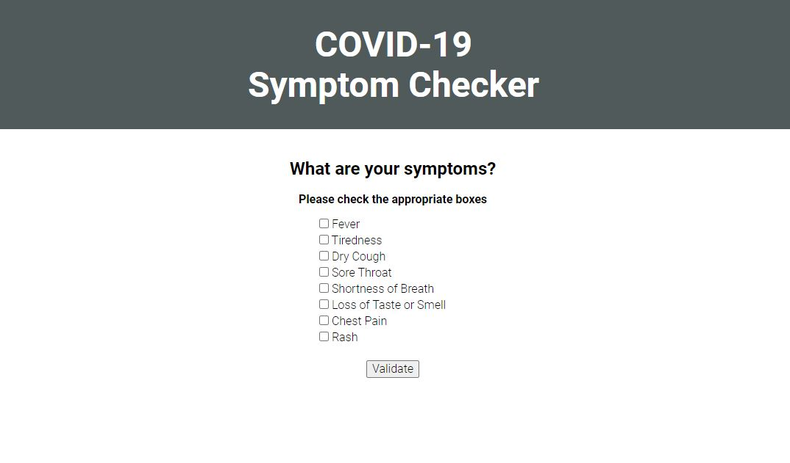

# COVID-19 Symptom Checker

## Description 
A Web App where users can list their symptoms and check to see if they match the symptoms of someone who has contracted COVID-19.  

If they are believed to have COVID-19, the user is provided a list of nearby COVID-19 testing centers.  

Otherwise, the user is provided a list of general practice offices nearby they can choose to go to for treatment. 

The user is also presented the COVID statts for their state, based on their location.

## Usage 

On initial page load, select to allow the application to access your location.  

Once permission has been granted, select any and all symptoms you are experincing and select to "Validate"

The application will determine whether you should either go to a COVID testing facility or if you should instead reach out to a nearby primary care physician for treatment.

Also, you will be shown the current COVID-19 statistics for your state based on your location.

## Tools used

Pure CSS Framework: [Pure](https://purecss.io/)
COVID-19 tracker API: [The COVID Tracking Project](https://covidtracking.com/)
Google Maps/Places API: [Places API](https://developers.google.com/places/web-service/overview)

## Credits

This application was a collaborative effort:
https://github.com/AndreeDantzler
https://github.com/treyjewett
https://github.com/fainimous

## License

MIT License

Copyright (c) [2020] [Chris Fain]

Permission is hereby granted, free of charge, to any person obtaining a copy
of this software and associated documentation files (the "Software"), to deal
in the Software without restriction, including without limitation the rights
to use, copy, modify, merge, publish, distribute, sublicense, and/or sell
copies of the Software, and to permit persons to whom the Software is
furnished to do so, subject to the following conditions:

The above copyright notice and this permission notice shall be included in all
copies or substantial portions of the Software.

THE SOFTWARE IS PROVIDED "AS IS", WITHOUT WARRANTY OF ANY KIND, EXPRESS OR
IMPLIED, INCLUDING BUT NOT LIMITED TO THE WARRANTIES OF MERCHANTABILITY,
FITNESS FOR A PARTICULAR PURPOSE AND NONINFRINGEMENT. IN NO EVENT SHALL THE
AUTHORS OR COPYRIGHT HOLDERS BE LIABLE FOR ANY CLAIM, DAMAGES OR OTHER
LIABILITY, WHETHER IN AN ACTION OF CONTRACT, TORT OR OTHERWISE, ARISING FROM,
OUT OF OR IN CONNECTION WITH THE SOFTWARE OR THE USE OR OTHER DEALINGS IN THE
SOFTWARE.